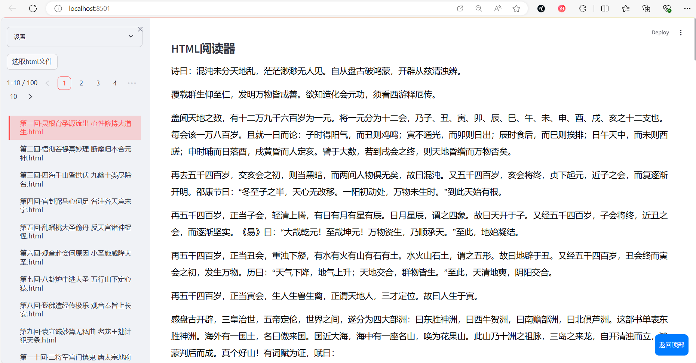

# **Streamlit实用案例 -- Html阅读器**

## 一、**案例亮点**

### 1、**使用多进程，在streamlit应用中，同时使用tkinter**
🚙 此方法同样适用于streamlit应用中，使用playwright 

### 2、**设置修改html页面元素的css样式**

### 3、**使用 js 实现 "返回顶部" 的操作**

### 4、**分页显示多个html文件名称**

## 二、**功能**

### 1、**批量选取html文件，点击后在主页面打开**

### 2、**可对页面样式进行设置**

设置内容包括：行间距、文字大小、加粗、背景颜色、文字颜色

## 三、**案例图片**

